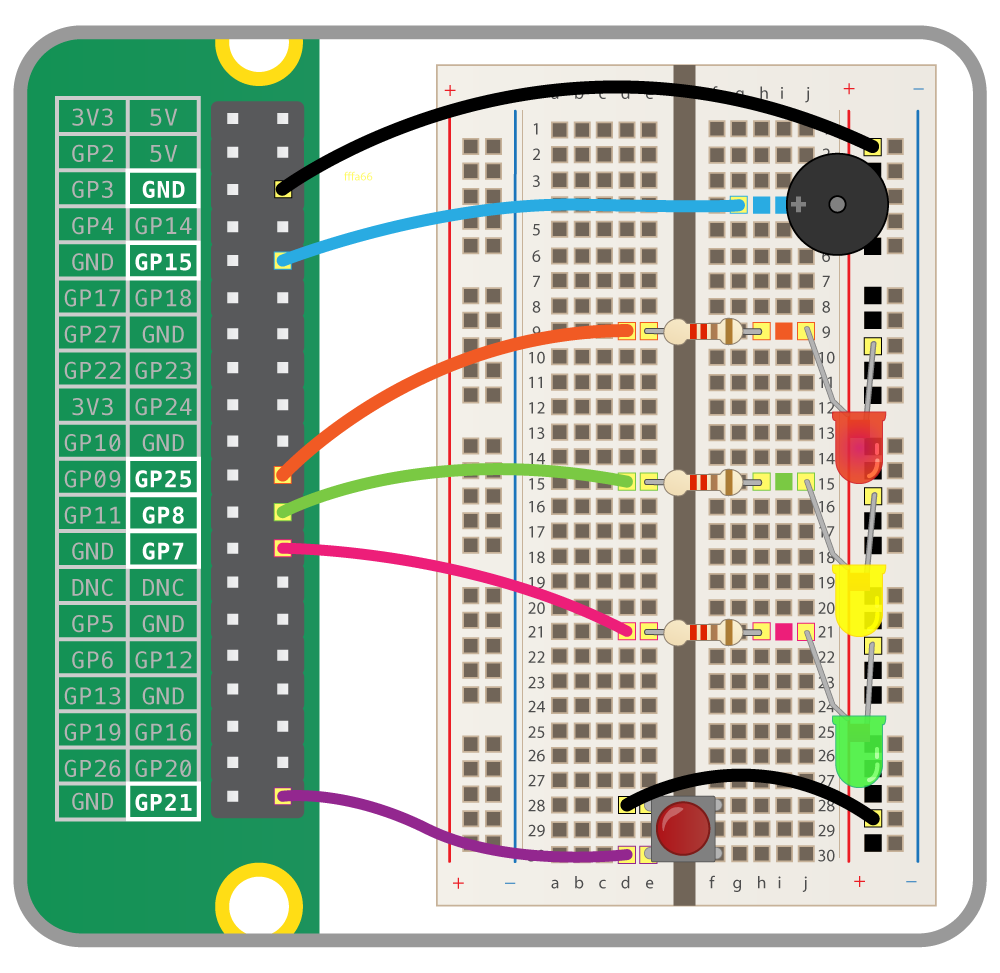

## Connect the components

\--- task \---

- Raspberry Pi
- 3x एल ई डी और प्रतिरोधों
- बटन
- बजर
- breadboard
- जम्पर तार

Wire up your components to the following GPIO pins:

| अंग         | GPIO पिन |
| ----------- |:--------:|
| बटन         |    21    |
| लाल एलईडी   |    25    |
| एम्बर एलईडी |    28    |
| ग्रीन एलईडी |    27    |
| बजर         |    15    |

\--- /task \---