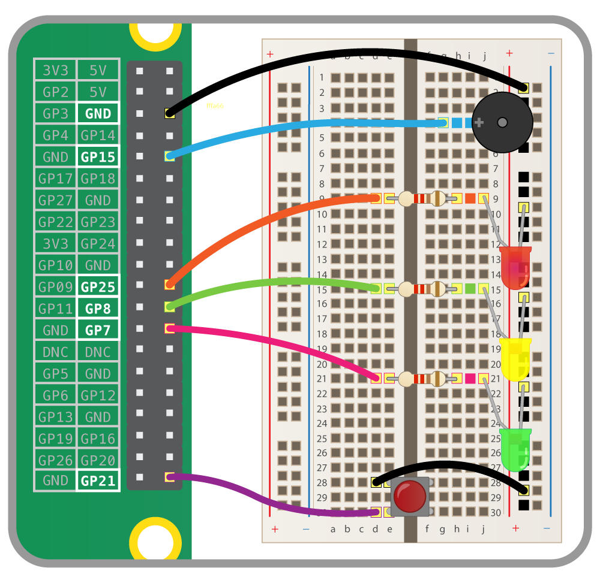

## Cosa ti serve

Collega i componenti ai seguenti pin GPIO:

- Raspberry Pi
- 3x LED e resistenze
- Pulsante
- Cicalino
- Breadboard
- Ponticelli

Wire up your components to the following GPIO pins:

| Componente | Pin GPIO |
| ---------- |:--------:|
| Pulsante   |    24    |
| LED rosso  |    25    |
| LED ambra  |    23    |
| LED verde  |    22    |
| Cicalino   |    5     |

\--- /task \---